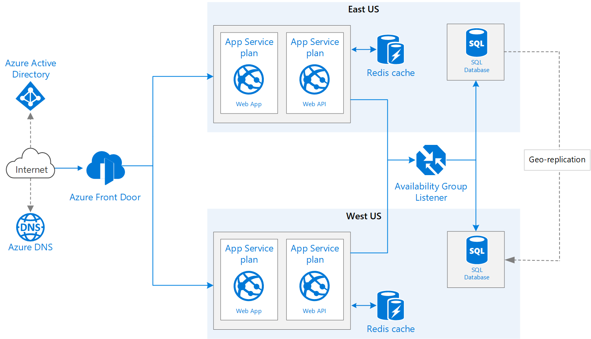

# Highly available multi-region web applications using App Service, Azure Redis Cache &amp; Azure SQL DB
This reference architecture shows how to run an Azure App Service application in multiple regions to achieve high availability.

# References

- https://docs.microsoft.com/en-us/azure/architecture/reference-architectures/app-service-web-app/multi-region
- https://github.com/Azure/azure-quickstart-templates
